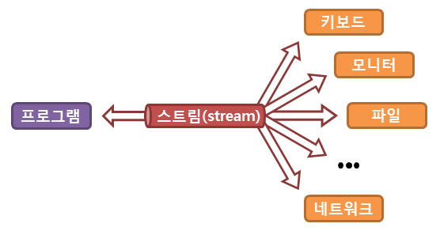
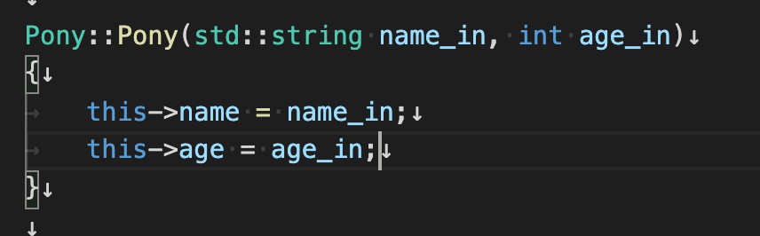

# cpp module
## subject 번역
[by Joockim](https://www.notion.so/CPP_MODULE-d127f182fb4340669314cf9354d303d8)

## CPP 코딩 표준

[구글 표준을 기준으로 하자](https://valueelectronic.tistory.com/161)

1. 함수/변수/파일명은 약어 사용하지 않고 서술형으로 짓는다.
   - 가능한 상세한 이름을 사용한다.
   - 다른 사람이 즉시 이해할 수 있는 것이 글자 길이를 줄이는 것보다 중요하다.
   - 제 3자에게 익숙하지 않은 약어를 사용하지 않으며, 축약하지 않는다.

2. 파일명/디렉터리명은 모두 소문자로하고 '_'를 사용
   - 이미 존재하는 파일 이름은 사용하지 않는다.
   - 파일 이름은 되도록 상세하게 짓는다.
   - 인라인 함수는 헤더 파일에 정의한다.
3. 타입 이름은 대문자로 시작하며 "_" 없이 단어마다 첫 글자를 대문자로 작성한다.
4. 변수 이름은 모두 소문자로 작성하며 언더바 사용
   - 전역변수는 g_ 접두어 사용
5. 상수 이름은 k로 시작하고, 대소문자가 섞인 형태를 사용한다.
6. 함수이름은 대문자로 시작하고 각 단어 첫 글자를 대문자로 사용
   - 실행 중 크래시가 발생할 수 있다면 함수의 이름 뒤에 OrDie를 붙인다.
7. 열거형 이름은 접두어 "e"를 붙이고, 각 단어의 첫 글자를 대문자로 쓰며 언더바 "_" 는 사용하지 않는다.
8. 가능하면 매크로를 사용하지 않는다. 매크로보다는 인라인함수, 열거형, const 변수를 사용한다.

#### *예외*

*표준 기술을 구현하는 경우, 해당 표준 문서 상의 표현과 통일성을 갖기 위해 문서 상에 정의된 이름/형태를 그대로 사용할 수 있다.*


## CPP00

### char[] to string

cpp에서 string이라는 변수타입이 새로 생겼는데, c에서 문자열을 다룰 때 사용하던 char[] 을 string으로 변환은 어떻게 할까?

- Char[] to string

```cpp
char ch2[100] = {"Oh my god"};
string str(ch2);

cout <<str<<endl;
```

string 선언시에 괄호안에 char변수를 넣어주면 된다.

* String to char[]

```cpp
char ch[100];
string a = "I wanna go to bed";
strcpy(ch,a.c_str());

cout<<ch<<endl;
```

1 ) c_str로 string변수를 char로 변환

2 ) strcpy로 ch변수에 변환값 저장


### std::end 과 "\n" 차이

https://yechoi.tistory.com/48


### 컴파일러 익스플로러로 코드 성능 비교하기

https://gcc.godbolt.org/


### Class 로 생성된 인스턴스는 메모리를 어떻게 사용하는가?

궁금한 이유, c 에서 포인터는 64비트 운영체제의 경우 8바이트를 차지한다는 것을 알기 때문에 구조체등을 인자로 받을 때 포인터로 받아서 메모리 복제에 소요되는 시간을 줄일 수 있었다. 클래스도 포인터로 넘겨주는게 좋은가?


### 입력 버퍼 ? 스트림?

http://www.tcpschool.com/cpp/cpp_io_streamBuffer



[C++에서 EOF (cnt+D) 로 종료 시](https://pythonq.com/so/c%2B%2B/1570575) 


## CPP01


### 클래스 생성자 만들 때, 어떤식으로 이름짓는게 좋은지 조언을 구해보자




### 소멸자에 virtual을 쓰는 이유

[링크](http://hyacinth.byus.net/moniwiki/wiki.php/C%2B%2B/%EC%86%8C%EB%A9%B8%EC%9E%90%EC%97%90%20virtual%EC%9D%84%20%EC%93%B0%EB%8A%94%20%EC%9D%B4%EC%9C%A0)


### 난수 발생

난수를 발생시킬 때 rand와 시드값 생성인 srand의 한계가 존재한다. > srand(time(0)) 은 초단위의 씨드이기 때문에 같은 난수가 사용될 확률이 매우 높다.

또한 나머지 연산자를 통해 최대값 미만의 난수를 얻는 방법을 주로 사용한는데, 여기서는 비균일 분포를 이룬다는 한계가 존재한다. 이는 금융 등


[c++ 에서는 c에서 쓰던 rand 와 srand를 갖다 버리자](https://modoocode.com/304)\

### 객체 메소드 


###  Menu

[Skip to content](http://hyacinth.byus.net/moniwiki/wiki.php/C%2B%2B/소멸자에 virtual을 쓰는 이유#content)

- [FrontPage](http://hyacinth.byus.net/moniwiki/wiki.php/FrontPage)
-  

- [대하여](http://hyacinth.byus.net/moniwiki/wiki.php/hyacinth)
-  

- [블로그](http://hyacinth.byus.net/moniwiki/wiki.php/Blog)
-  

- [사진](http://hyacinth.byus.net/moniwiki/wiki.php/사진)

### [C++](http://hyacinth.byus.net/moniwiki/wiki.php/C%2B%2B)[/소멸자에 virtual을 쓰는 이유](http://hyacinth.byus.net/moniwiki/wiki.php/C%2B%2B/소멸자에 virtual을 쓰는 이유?action=fullsearch&backlinks=1&value=C%2B%2B/소멸자에 virtual을 쓰는 이유)

먼저 상속을 받은 클래스의 생성과 소멸 과정을 보자. 생성자는 부모 클래스의 생성자가 먼저 불려지고, 소멸자는 자식 클래스의 소멸자가 먼저 불려지고 나서 부모 클래스의 소멸자가 불려진다.

그런데 다형성 이용을 위해 부모 클래스의 포인터로부터 자식 클래스를 호출할 때, 가상 함수로 정의되지 않은 자식 클래스의 오버라이딩된 함수를 호출하면 부모 클래스의 멤버 함수가 호출된다. 소멸자도 자식 클래스에서 오버라이딩된 함수라고 볼 수 있기 때문에 만약 부모 포인터로 객체를 삭제하면 부모 클래스의 소멸자가 호출된다.

따라서 소멸자를 가상 함수로 선언하지 않으면 이 경우 자식 클래스의 소멸자는 결코 호출되지 않는다. 가상 함수 키워드 virtual이 사용되었다면 이것은 자식 클래스에서 재정의될 수 있음을 명시하기 때문에 포인터의 종류에 상관없이 항상 자식 클래스의 메서드가 호출된다. 즉, 자식 클래스의 소멸자가 호출되고 나서 부모 클래스의 소멸자가 호출된다.

따라서 상속 관계가 있고 소멸자에서 리소스를 해제해야 하는 경우 반드시 소멸자를 가상 함수로 선언해야 한다.


### [생성자 멤버 초기화 리스트](https://boycoding.tistory.com/246)

## CPP02

### static const int ?

### 연산자 오버로딩

[연산자의 반환값 lvalue rvalue](https://m.blog.naver.com/PostView.nhn?blogId=iii4625&logNo=221228764984&proxyReferer=https:%2F%2Fwww.google.com%2F)

대입연산자 오버로딩

```
a.operator=(b); 
```

### cout << 연산자 오버로딩 시 전역으로 해주는 이유

```cpp
std::ostream	&operator<<(std::ostream &out, const Fixed &a)
{
	out << a.toFloat();
	return (out);
}
```

연산자 호출의 주체는 lvalue 이기 때문에, std::ostream class의 `<< ` 연산자를 오버로딩을 해주어야한다. 

하지만 ostream 객체는 표준라이브러리 내의 객체이기 때문에 객체 내부에 연산자 오버로딩을 추가 할 수 없다. 

즉, 연산자 오버로딩을 추가해주기 위해서는 전역으로 정의해주는 방식 뿐이다.


### Class Canonical form

[Canonical form 이란?](https://m.blog.naver.com/PostView.nhn?blogId=qbxlvnf11&logNo=221971400151&proxyReferer=https:%2F%2Fwww.google.com%2F) : **수학적 수식으로 나타내어질 수 있는 객체의 표현형을 고유하게 나타내는 표준 방식을 말한다.

class의 coplien form

```cpp
class A
{
public:
  A(); // 기본 생성자
  A(const A &a); // 복사 생성자
  ~A(); // 소멸자 (only one)
  A 	&operator=(const A &a); // 대입 연산자.
}
```


## CPP03

### [다중 상속(multiple inheritance)이란?](https://m.blog.naver.com/PostView.nhn?blogId=kks227&logNo=60207057116&proxyReferer=https:%2F%2Fwww.google.com%2F)

### [가상상속이란?](https://hwan-shell.tistory.com/224)

### [다이아몬드 상속이란? 피하는방법은?](https://codingcoding.tistory.com/517)

### 객체 지향 용어

수퍼 클래스 = 기본/기초/부모 클래스 

서브 클래스 = 자식 클래스


### 서브 클래스 생성 시에 메모리에는 어떤식으로 클래스가 생성되는 걸까?


## [Class 상속에 따른 메모리구조](https://www.sysnet.pe.kr/2/0/11164)

> class 는 기본 1byte 먹는다.


### Byte 패딩

바이트 패딩은 32bit, 64bit cpu 의 연산 효율을 위해서! 데이터를 맞춰서 정렬하는거다 ( 4byte, 8byte ) 남는 바이트에 패딩채워서 


## CPP04

**keyword** 

- Subtype polymorphism
- abstract classes
- interfaces

### [friend class 란?](https://yeolco.tistory.com/116)


### [Virtual function vs Pure virtual function](https://stackoverflow.com/questions/2652198/difference-between-a-virtual-function-and-a-pure-virtual-function)


### [스코프가 뭐지?](https://brunch.co.kr/@stdcpp/15) 


### [public / private / protected](https://eurekadeveloper.tistory.com/entry/public-private-protect%EC%9D%98-%EC%B0%A8%EC%9D%B4%EC%A0%90) 


### [Interface class 는?](https://igotit.tistory.com/entry/C%ED%81%B4%EB%9E%98%EC%8A%A4-%EC%9D%B8%ED%84%B0%ED%8E%98%EC%9D%B4%EC%8A%A4-%ED%81%B4%EB%9E%98%EC%8A%A4-interface)

가상 소멸자와! 순수 가상함수로만 구성되어있는 클래스.

### [virtual의 동작 원리](https://sexycoder.tistory.com/10)

- 상속 / 오버라이딩  에 대해서도 제대로 알아야할듯.


### [가상함수테이블!!](https://sexycoder.tistory.com/10)


## CPP 05

### std::exception 을 상속받아서 what() 함수 오버라이딩 시 

`virtual const char *what() const throw()` 에서 **[throw()의 의미](https://stackoverflow.com/questions/5230463/what-does-this-function-declaration-mean-in-c)**는?

- `throw()` means that you promise to the compiler that this function will never allow an exception to be emitted. This is called an *exception specification*, and (long story short) is useless and possibly misleading.

### [함수 포인터 배열 만들기](https://pang2h.tistory.com/287)

함수 포인터 또한 자료형이다. 모든 자료형은 배열을 만들 수 있다. 

함수 포인터를 배열로 만들어 이용해보자!

#### 생성 방법

```c++
int (*fp[10])(int) = {func1, func2, func3};

fp[3] = func4;
```

#### 사용 방법

```c++
int (*fp[10])(const char *, ...) = {printf,};

(*fp[0])("Hello world!\n");
// or
fp[0]("Hello world!\n");
```

